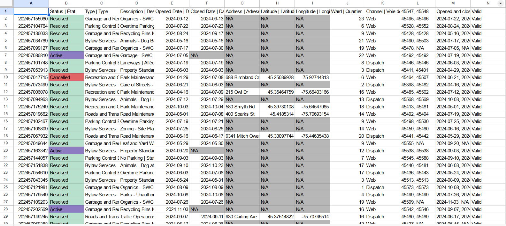
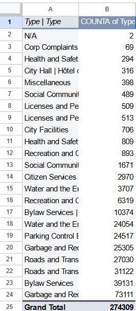
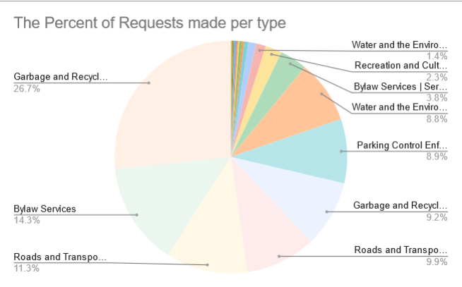

**11/5/2024**<br>
**mpad2003 Data Storytelling**<br>
**Samy Poirier**<br>
**Presented to Jean-Sébastien Marier**<br>

# Midterm Project: Exploratory Data Analysis (EDA)

## 1. Introduction

This analysis focuses on a dataset from the City of Ottawa, containing municipal service requests submitted by residents between August 1 and September 1, 2024. The data, sourced from the **[City of Ottawa's Open Data Portal](https://open.ottawa.ca/documents/65fe42e2502d442b8a774fd3d954cac5/about)** and available as a **[CSV on GitHub](https://raw.githubusercontent.com/jsmarier/course-datasets/refs/heads/main/ottawa-311-service-requests-august-2024.csv)**, provides a comprehensive look at the types of municipal services residents require and the methods they use to submit requests. Key details include service request IDs, categories (e.g., garbage collection, bylaw services), statuses (resolved, active, canceled), and submission channels (phone, web, walk-in). Geographical coordinates allow for spatial analysis, while open and close date fields enable us to evaluate response times. This project walks through essential steps: data importation, cleaning, a VIMO analysis for data quality, exploratory analysis, and potential story ideas.

## 2. Getting Data

To conduct this analysis, the dataset was imported into Google Sheets, a practical platform for data manipulation and visualization. Below are the steps taken to import the data:

### Steps to Import the CSV File into Google Sheets

1. **Download the CSV File**:
    - Just simply click on the City of Ottawa's Open Data Portal link and it will automatically dowload the csv file onto your computer.

2. **Open Google Sheets and Start a New Document**:
    - Open a new sheet in Google Sheets for organization and analysis.

3. **Import the CSV File**:
    - Go to **File > Import** in Google Sheets, select **Upload** and choose the saved CSV file. Set **Replace spreadsheet** as the import option and **Comma** as the separator. Confirm by selecting **Import data**.

<br>
*Figure 1: Importing CSV data into Google Sheets.*

### General Observations of the Imported Dataset

- **Dataset Size**: Contains 11 columns and 28,539 rows, making it a sizable dataset for analysis.
- **Initial Cleanliness**: The data appears organized, but certain fields contain `\N`, suggesting missing or undefined values that require attention. There are also two empty columns M and L.

### Specific Column Observations

- **Column A (Service Request ID)**: Contains unique identifiers for each request, which aids in tracking.
- **Column B (Status)**: Uses nominal values like “Resolved,” “Active,” and “Canceled,” showing the progression or closure of each request.
- **Columns E and F (Open and Close Dates)**: Indicate when requests were submitted and, if closed, the date of resolution. Rows lacking a Close Date likely represent unresolved requests.

### Formulated Questions and Hypotheses

One immediate question is whether specific request types are more prevalent in certain wards, reflecting localized issues. Additionally, we hypothesize that some service categories (e.g., garbage collection) might experience longer response times, indicating potential capacity challenges.

**Link to Google Sheets Dataset**: [Link to public Google Sheets dataset](https://docs.google.com/spreadsheets/d/1D_2vA7c9R6Cu9sLEf6rqvg3PJEu7KNSzBzMQ3pSQG5g/edit?usp=sharing)

## 3. Understanding Data

This section examines the dataset’s reliability and relevance using the VIMO framework (Valid, Invalid, Missing, and Outlier) and details the essential cleaning processes.

### 3.1. VIMO Analysis

The VIMO framework assesses data quality by identifying Valid, Invalid, Missing, and Outlier entries, following principles from *The Truthful Art* by Cairo (2016). This approach helps us maintain a structured, reliable dataset, avoiding pitfalls in analysis and interpretation.

1. **Validity**:
   - **Valid Data**: Most entries in “Status” and “Type” categories appear valid, using expected classifications like “Resolved,” “Active,” or “Canceled” for Status, and “Garbage and Recycling” or “Bylaw Services” for Type. This consistency ensures that data interpretation is accurate and clear.
   - **Invalid Data**: Any data deviating from these categories (e.g., misspelled statuses or unexpected request types) would be flagged as invalid and corrected for standardization across the dataset.

2. **Missing Data**:
   - **Identification**: Missing values, often marked as `\N`, appear in geographic fields like “Address” and “Latitude/Longitude,” which impacts spatial analysis. Missing dates in “Close Date” fields imply unresolved cases, complicating response time evaluations.
   - **Handling Missing Data**: Replaced `\N` entries with “NULL” to make gaps visible and used conditional formatting to highlight missing values for targeted analysis.

3. **Outliers**:
   - **Outliers in Dates**: Requests with very short or long open-close times may indicate outliers. For instance, requests closed on the same day may be routine resolutions, while prolonged cases could suggest unresolved issues. These anomalies are essential for assessing city response times.
   - **Address and Location Outliers**: Some “Walk-In” requests lack geographic coordinates or addresses, possibly due to data entry errors or incomplete records, an issue highlighted by Cairo in ensuring accurate data for storytelling.

### 3.2. Cleaning Data

Data cleaning is crucial for ensuring consistency and accuracy. Several cleaning techniques were applied to address missing values, inconsistencies, and structural improvements.

1. **Trimming Whitespace**:
   - Extra spaces in categorical fields (e.g., Status) can create inconsistencies. Selected **Data > Data Cleanup > Trim Whitespace** to remove these spaces, affecting 9,819 cells in column G, 5,521 cells in column D, and 1 cell in column A.

2. **Concatenating Date Columns**:
   - Combined Open and Close Dates into a single field to streamline date-based analysis:
     ```r
     =TEXT(E2, "yyyy-mm-dd") & " - " & TEXT(F2, "yyyy-mm-dd")
     ```

3. **Handling Missing Data**:
   - Replaced `\N` values with “N/A” for easier recognition of missing data. For certain analysis needs, entries in the "Type" column were labeled as "Unspecified." This adjustment was made using **Find and Replace**.

4. **Using Conditional Formatting**:
   - Applied conditional formatting to differentiate statuses (Resolved, Active, Canceled) and highlight missing values, improving readability and enabling quick interpretation.

5. **Validating Data Entries**:
   - Added a check to confirm that service request IDs contain numeric values:
     ```r
     =IF((ISNUMBER(A2)), "Valid", "Invalid")
     ```

<br>
*Figure 2: The cleaned dataset with conditional formatting applied.*

### 3.3. Exploratory Data Analysis (EDA)

With the cleaned dataset, exploratory data analysis was performed to reveal key trends, categories, and anomalies.

1. **Pivot Table**:
   - Created a pivot table summarizing service request counts by type using COUNTA, showing Garbage and Recycling as the most common request.

2. **Exploratory Chart**:
   - A pie chart was generated to visualize service request types. Garbage and Recycling was the dominant category, underscoring potential waste management issues.

3. **Analysis and Key Findings**:
   - **Why These Variables?**: "Type" was chosen due to its relevance in understanding resident needs, aiding the city in prioritizing resources. 
   - **Standout Statistic**: The high volume of Garbage and Recycling requests suggests challenges in waste collection and recycling.
   - **Potential Story**: Data suggests dissatisfaction with waste management services, pointing toward possible improvements in infrastructure and public awareness.

<br>
*Figure 3: Pivot table summarizing request types.*

<br>
*Figure 4: Pie chart of service requests by type.*

## 4. Potential Story

The dataset suggests a story around **Ottawa’s Waste Management**. The volume of Garbage and Recycling requests indicates potential issues with waste collection efficiency or resident awareness about disposal practices. 

To further develop this story:
- **Additional Data**: Surveys from residents could provide qualitative insights into their experiences and expectations.
- **Interviews**: Speaking with waste management officials and city council members could offer perspectives on challenges and solutions.
- **Research Sources**:
    - Statistics Canada reports on Canadian waste management trends offer comparative context for Ottawa.
    - Victor Tran’s article on Canada’s per capita waste output provides insights into national recycling policies and potential improvements&#8203;:contentReference[oaicite:0]{index=0}.

## 5. Conclusion

Completing this project highlighted both challenges and rewards. Handling a large dataset was demanding, particularly in cleaning and structuring it. However, transforming raw data into meaningful insights on Ottawa’s municipal services was rewarding. Reflecting on this process, I recognize the need to improve my skills in managing large datasets, especially for data consistency. In future analyses, I might focus on specific areas initially, filtering data or using specialized tools for large-scale handling.

## 6. References

Cairo, A. (2016). *The Truthful Art: Data, Charts, and Maps for Communication*. New Riders.

Statistics Canada. (2021). *Steps of the Data Journey*. Retrieved from [Statistics Canada](https://www.statcan.gc.ca/en/wtc/data-literacy/journey).

Tran, V. (2023). *Canada’s Waste and Recycling Problem*. The Peak.

*
